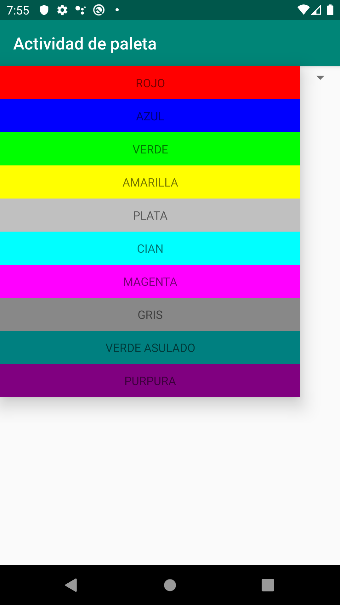

# ColorPalette-Spanish
Name: Peter Zheng / Mobile Application CIS 3515 Section 3

App Function:
Displays a spinner that uses a custom adapter. The spinner will show a bunch of textviews with a color name and their background
will be the respective color. When an item is selected from the spinner, it will launch a second activity that shows a layout with
the color name and the background set to the color. 

Added Spanish Translation.

